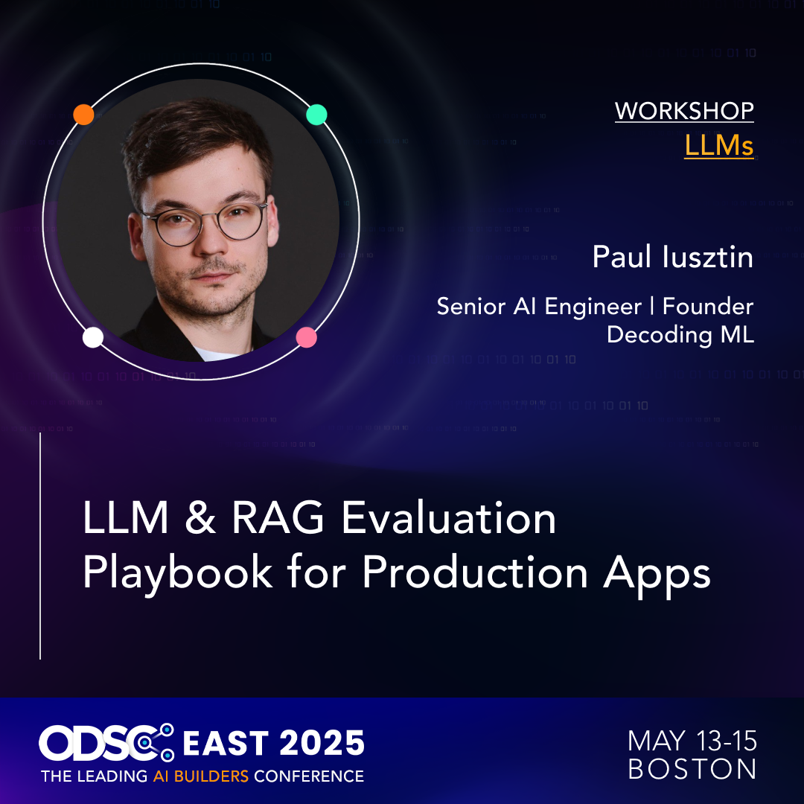

<div align="center">
  <h1>LLM & RAG Evaluation Playbook</h1>
  <h3>A comprehensive guide for evaluating LLMs, RAG and agentic systems in production applications</h3>
  <p class="tagline"> <a href="https://odsc.com/speakers/llm-rag-evaluation-playbook-for-production-apps/">ODSC 2025 Webinar by Paul Iusztin</a> - Click to learn more about the webinar and speaker</p>
</div>

<div align="center">
    <a href="https://odsc.com/speakers/llm-rag-evaluation-playbook-for-production-apps/">
        
    </a>
</div>

This guide will help you set up and run the webinar, where we will explore the following topics:

- Add a prompt monitoring layer.
- Visualize the quality of the embeddings.
- Evaluate the context from the retrieval step used for RAG.
- Compute application-level metrics to expose hallucinations, moderation issues, and performance (using LLM-as-judges).
- Log the metrics to a prompt management tool to compare the experiments.
- Version the prompts

<div align="center">
    <a href="https://odsc.com/speakers/llm-rag-evaluation-playbook-for-production-apps/">
        
    </a>
</div>

# 📑 Table of Contents

- [📋 Prerequisites](#-prerequisites)
- [🎯 Getting Started](#-getting-started)
- [📁 Project Structure](#-project-structure)
- [🏗️ Set Up Your Local Infrastructure](#-set-up-your-local-infrastructure)
- [⚡️ Running the Code](#️-running-the-code)
- [🔗 Socials](#-socials)
- [📚 Continue Your Learning Journey](#-continue-your-learning-journey)

# 📋 Prerequisites

## Local Tools

For all the modules, you'll need the following tools installed locally:

| Tool | Version | Purpose | Installation Link |
|------|---------|---------|------------------|
| Python | ≥ 3.12 | Programming language runtime | [Download](https://www.python.org/downloads/) |
| uv | ≥ 0.4.30 | Python package installer and virtual environment manager | [Download](https://github.com/astral-sh/uv) |
| GNU Make | ≥ 3.81 | Build automation tool | [Download](https://www.gnu.org/software/make/) |
| Git | ≥2.44.0 | Version control | [Download](https://git-scm.com/downloads) |
| Docker | ≥27.4.0 | Containerization platform | [Download](https://www.docker.com/get-started/) |

<details>
<summary><b>📌 Windows users also need to install WSL (Click to expand)</b></summary>

We will be using Unix commands across the course, so if you are using Windows, you will need to **install WSL**, which will install a Linux kernel on your Windows machine and allow you to use the Unix commands from our course (this is the recommended way to write software on Windows). 

🔗 [Follow this guide to install WSL](https://www.youtube.com/watch?v=YByZ_sOOWsQ).
</details>

## Cloud Services

Also, the course requires access to these cloud services. The authentication to these services is done by adding the corresponding environment variables to the `.env` file:

| Service | Purpose | Cost | Environment Variable | Setup Guide |
|---------|---------|------|---------------------|-------------|
| [Opik](https://rebrand.ly/philoagents-opik) | LLMOps | Free tier (Hosted on Comet - same API Key) | `COMET_API_KEY` | [Quick Start Guide](https://rebrand.ly/philoagents-opik-quickstart) |
| [OpenAI API](https://openai.com/index/openai-api/) | LLM API used for evaluation | Pay-per-use | `OPENAI_API_KEY` | [Quick Start Guide](https://platform.openai.com/docs/quickstart) |

# 🎯 Getting Started

## 1. Clone the Repository

Start by cloning the repository and navigating to the `workshops/odsc-2025-evaluation-playbook/solution` project directory:
```
git clone https://github.com/decodingml/workshops.git
cd workshops/odsc-2025-evaluation-playbook/solution
```

Next, we have to prepare your Python environment and its dependencies.

## 2. Choose Between the Solution or Template directory

Within the `solution` directory, we have the end-to-end solution, which is helpful for testing the code and verifying the solution.

We have the webinar code within the `template` directory, where you must implement parts of the code related to LLMOps and observability.

So, change the directory to `solution` or `template` depending on your goal.

## 3. Installation

We will use `uv` to install the dependencies and activate the virtual environment:

```bash
uv sync
```

Test that you have Python 3.12.7 installed in your new `uv` environment:
```bash
uv run python --version
# Output: Python 3.12.7
```

This command will:
- Create a virtual environment with the Python version specified in `.python-version` using `uv`
- Activate the virtual environment
- Install all dependencies from `pyproject.toml`

## 4. Environment Configuration

Before running any command, inside the `odsc-2025-evaluation-playbook/solution` directory, you have to set up your environment:
1. Create your environment file:
   ```bash
   cp .env.example .env
   ```
2. Open `.env` and configure the required credentials following the inline comments and the recommendations from the [Cloud Services](#-prerequisites) section.

# 📁 Project Structure

The project follows a clean architecture structure commonly used in production Python projects:

```bash
odsc-2025-evaluation-playbook/solution/
    ├── data/                       # Data files
    ├── src/evaluation_playbook/    # Python package
    ├── tools/                      # Entrypoint scripts that use the Python package
    ├── .env.example                # Environment variables template
    ├── .python-version             # Python version specification
    ├── docker-compose.yml          # Docker compose hosting Qdrant through Docker
    ├── Makefile                    # Project commands
    └── pyproject.toml              # Project dependencies
```

# 🏗️ Set Up Your Local Infrastructure

We use Docker to set up the local infrastructure, more exactly a Qdrant vector database.

> [!WARNING]
> Before running the command below, ensure you do not have any processes running on ports `6333` (Qdrant).

From the root `odsc-2025-evaluation-playbook/template` directory (or `solution`), to start the Docker infrastructure, run:
```bash
make local-infrastructure-up
```

From the root `odsc-2025-evaluation-playbook/template` directory (or `solution`), to stop the Docker infrastructure, run:
```bash
make local-infrastructure-down
```

----

<table style="border-collapse: collapse; border: none;">
  <tr style="border: none;">
    <td width="20%" style="border: none;">
      <a href="https://decodingml.substack.com/" aria-label="Decoding ML">
        
      </a>
    </td>
    <td width="80%" style="border: none;">
      <div>
        <h2>📬 Stay Updated</h2>
        <p><b><a href="https://decodingml.substack.com/">Join Decoding ML</a></b> for proven content on designing, coding, and deploying production-grade AI systems with software engineering and MLOps best practices to help you ship AI applications. Every week, straight to your inbox.</p>
      </div>
    </td>
  </tr>
</table>

<p align="center">
  <a href="https://decodingml.substack.com/">
    
  </a>
</p>

# ⚡️ Running the Code

To showcase our ideas related to evaluation and observability, we will use a simple RAG agent implemented in LangGraph, as seen in the image below:


The project provides several make commands to interact with the philosophical agent and run evaluations:

## 1. Initialize Long-Term Memory (Prepare Data)

Before using the agent, you need to initialize its long-term memory, which will populate the Qdrant vector database with relevant context:

```bash
make create-long-term-memory
```

To check that everything worked fine, the easiest way is to check [Qdrant's Dashboard](localhost:6333/dashboard).

## 2. Query the Agent & Monitor the Prompt Traces (Module 1)

You can interact with the philosophical agent using the `call-agent` command. By default, it uses Plato as the philosopher and asks about his life:

```bash
make call-agent PHILOSOPHER_ID="plato" QUERY="When and where were you born? Also tell me more about your life, work and beliefs."
```

You can customize the philosopher and query using variables:

```bash
make call-agent PHILOSOPHER_ID="turing" QUERY="What is your view on ethics when it comes to build intelligent machines? Also, tell me more about the Turing Test."
```

#### Prompt Monitoring

Visualize the **prompt traces** in [Opik's dashboard -> Projects -> odsc-2025-evaluation-playbook-webinar](https://www.comet.com/opik?utm_source=philoagents_course&utm_campaign=opik&utm_medium=course).

## 3. Visualize the Embeddings in Qdrant (Module 2)

Now let's visualize the embeddings of the chunks ingested in the long term memory, more exactly in Qdrant.

Type in your browser `localhost:6333/dashboard` to access [Qdrant's Dashboard](localhost:6333/dashboard).

Then go to the `philosopher_long_term_memory` collection -> `Visualize` tab and run the default query.

To add a filter on a specific philosopher (entity) you can run the following query inside the `Visualize` tab:
```json
{
  "limit": 500,
   "filter": {
        "must": [
            { "key": "metadata.philosopher_id", "match": { "value": "plato" } }
        ]
    }
}
```

## 4. Run Evaluations (Module 2 & 3)

To evaluate the agent's performance, first upload an evaluation dataset:

```bash
make upload-evaluation-dataset
```

Visualize the **evaluation dataset** in [Opik's dashboard -> Datasets -> odsc-2025-evaluation-playbook-slim-dataset](https://www.comet.com/opik?utm_source=philoagents_course&utm_campaign=opik&utm_medium=course).

Then run the evaluation:

```bash
make evaluate-agent
```

Visualize the **evaluation results (experiments)** in [Opik's dashboard -> Experiments](https://www.comet.com/opik?utm_source=philoagents_course&utm_campaign=opik&utm_medium=course)

#### Prompt Versioning

Visualize the **versioned prompts** in [Opik's dashboard -> Prompt library](https://www.comet.com/opik?utm_source=philoagents_course&utm_campaign=opik&utm_medium=course).

📖 [Read more](https://www.comet.com/docs/opik/evaluation/metrics/overview?utm_source=philoagents_course&utm_campaign=opik&utm_medium=course) on the evaluation metrics, such as how to interpret the numbers and how they are computed.

## 5. User Feedback (Module 4)

As we don't have a UI, to show case the core idea, we collect user feedback directly from Opik. Thus, go to [Opik's dashboard -> Projects -> odsc-2025-evaluation-playbook-webinar](https://www.comet.com/opik?utm_source=philoagents_course&utm_campaign=opik&utm_medium=course),
pick a prompt trace, go to feedback scores, and label the prompt traces as correct or not correct and optionally pick a quality score between 0 and 1.

As we don't have a UI to showcase the core idea, we collect user feedback directly from Opik. Thus, go to 
[Opik's dashboard -> Projects -> odsc-2025-evaluation-playbook-webinar](https://www.comet.com/opik?utm_source=philoagents_course&utm_campaign=opik&utm_medium=course). Then go to feedback scores, label the prompt traces as correct or incorrect, and optionally pick a quality score between 0 and 1.


> [!WARNING] 
> Note that these have to be configured separately per user workspace.


## 6. Help

For help on all the supported commands, run:

```bash
make help
```

# 🔗 Socials

[](https://decodingml.substack.com/)
[](https://decodingml.substack.com/)
[](https://www.linkedin.com/in/pauliusztin/)
[](https://x.com/iusztinpaul)

# 📚 Continue Your Learning Journey

## 🧍‍♂️ PhiloAgents Open-Source Course

If you enjoyed the workshop check out the open-source [**PhiloAgents Course**](https://github.com/neural-maze/philoagents-course), which the workshop it's inspired from.

Within the course you can learn how to build an AI-powered game simulation engine to impersonate popular philosophere, and it's:
- 100% free
- 6 modules with video and written lessons
- takes you from 0 to hero in implementing production-ready agents using LangGraph, Opik, Groq, FastAPI and more!
- it's fun! you will learn to transform static NPCs into real philosophers you can talk to into a retro game

The course is a collaboration between [Decoding ML](https://decodingml.substack.com/) and [The Neural Maze](https://theneuralmaze.substack.com/).

📌 [Check it out on GitHub](https://github.com/neural-maze/philoagents-course)


## 📙 Other Useful Resources

- [Opik Documentation](https://www.comet.com/docs/opik/?utm_source=philoagents_course&utm_campaign=opik&utm_medium=course)
- [🚀 LangGraph Quickstart](https://langchain-ai.github.io/langgraph/tutorials/introduction/)
- [Qdrant Installation](https://qdrant.tech/documentation/guides/installation/)
- [Qdrant Quickstart](https://qdrant.tech/documentation/quickstart/)
- [Qdrant LangChain](https://python.langchain.com/docs/integrations/vectorstores/qdrant/)

----

<table style="border-collapse: collapse; border: none;">
  <tr style="border: none;">
    <td width="20%" style="border: none;">
      <a href="https://decodingml.substack.com/" aria-label="Decoding ML">
        
      </a>
    </td>
    <td width="80%" style="border: none;">
      <div>
        <h2>📬 Stay Updated</h2>
        <p><b><a href="https://decodingml.substack.com/">Join Decoding ML</a></b> for proven content on designing, coding, and deploying production-grade AI systems with software engineering and MLOps best practices to help you ship AI applications. Every week, straight to your inbox.</p>
      </div>
    </td>
  </tr>
</table>

<p align="center">
  <a href="https://decodingml.substack.com/">
    
  </a>
</p>
